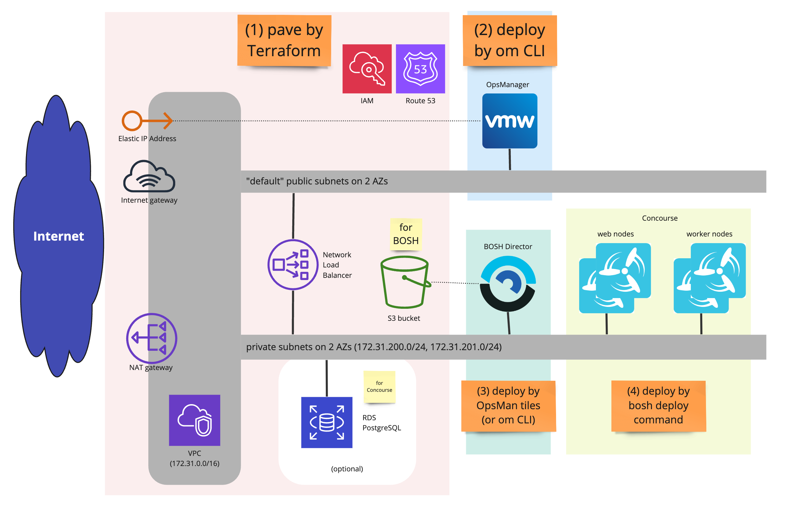

# AWS pavement for Concourse multi-AZ deployment



## Prerequisites

- AWS API access
  one of followings:
  - access_key_id/private_access_key(/session_token) of an IAM user that has enough privileges
  - AWS EC2 instance with IAM instance profile that has enough privileges
- 1 Hosted Zone on AWS Route 53
- a SSH keypair on AWS EC2

### mandatory privileges

Follow [these instructions](https://docs.pivotal.io/ops-manager/2-9/aws/prepare-env-terraform.html)
to create an IAM user that is needed to run the terraform templates.

The above instructions specify manual steps for creating the IAM user. If you have the `aws` cli,
you can follow these steps:

```console
$ export AWS_IAM_POLICY_DOCUMENT=/tmp/policy-document.json

$ echo '{
    "Version": "2012-10-17",
    "Statement": [
        {
            "Sid": "VisualEditor0",
            "Effect": "Allow",
            "Action": [
                "ec2:*",
                "elasticloadbalancing:*",
                "iam:*",
                "route53:*",
                "s3:*",
                "rds:*"
            ],
            "Resource": "*"
        }
    ]
}' > $AWS_IAM_POLICY_DOCUMENT

$ export AWS_IAM_USER_NAME="REPLACE-ME"

$ aws iam create-user --user-name $AWS_IAM_USER_NAME

$ aws iam put-user-policy --user-name $AWS_IAM_USER_NAME \
	--policy-name "policy" \
	--policy-document file://$AWS_IAM_POLICY_DOCUMENT

$ aws iam create-access-key --user-name $AWS_IAM_USER_NAME
```
